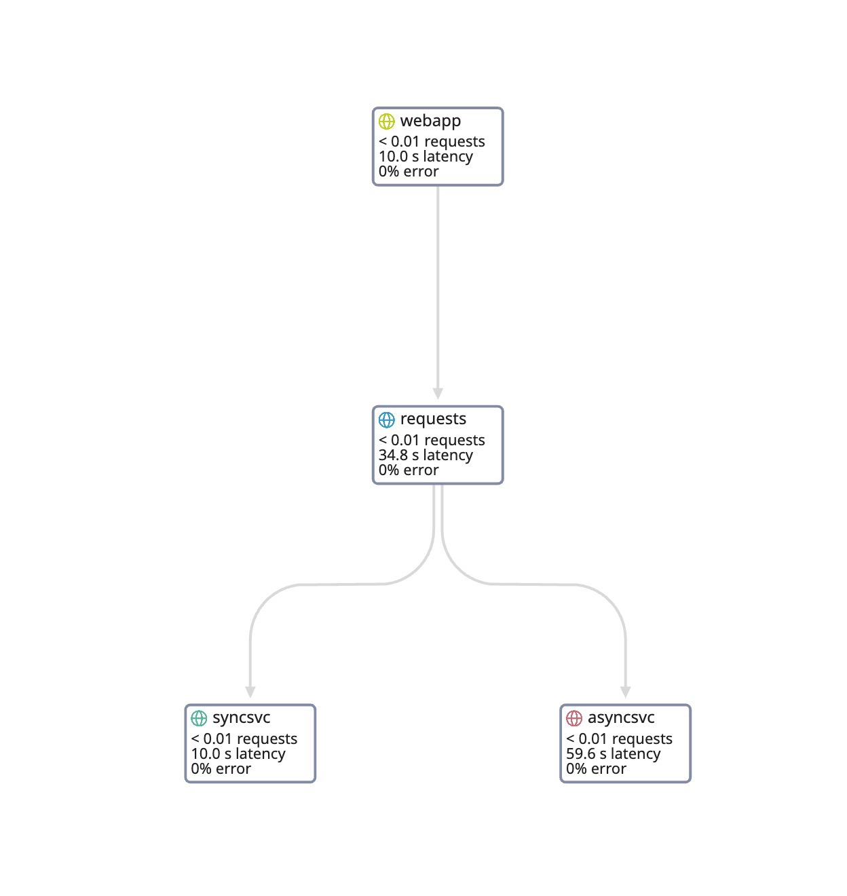

This repository contains a test application built to investigate how CPU requests and limits can affect application performance and end to end latency. It also contains suggestions on what metrics are available in the different layers (`kubelet`, `containerd`, etc.) to prevent, identify and debug this type of issues.

# Architecture

The application has a main web service, `webapp`, that calls two micro-services that generate CPU load. One is called synchronously, the other asynchronously (fire & forget).



## `webapp`

The main web service, `webapp`, exposes a couple of endpoints:

 * `/`: Just a test endpoint, returns "Hello, world!"
 * `/do_work`: The main endpoint, which launches a call to the `sync` service, to the `async` service, or both. It has several parameters:
   * `type`: the type of service to call. Potential values: `async`, `sync`, `both`. Default: `both`.
   * `ncpus_sync`: the number of CPUs to stress in the `sync` service. Default: 2.
   * `ncpus_async`: the number of CPUs to stress in the `async` service. Default: 2.
   * `ops_sync`: the number of bogus operations to run to stress the CPUs in the `sync` service. Default: 5000.
   * `ops_async`: the number of bogus operations to run to stress the CPUs in the `async` service. Default: 10000.

## `loadsvc`

The `loadsvc` micro-service is the web service that gets deployed both as the `sync` and the `async` services. `loadsvc` uses [stress-ng](https://github.com/ColinIanKing/stress-ng) to generate CPU load. **WARNING** As `stress-ng` states in their [README](https://github.com/ColinIanKing/stress-ng/blob/master/README.md), it has to be used with caution, as some of the tests can make a system run hot on poorly designed hardware and also can cause excessive system thrashing which may be difficult to stop. `loadsvc` uses only a very small set of `stress-ng`'s features, so it should be pretty safe to run.

It exposes two endpoints:

 * `/`: Test endpoint, returns the number of CPUs in the node where the pod is deployed
 * `/load`: The main endpoint, which launches `stress-ng`. It has a couple of parameters:
   * `ncpus`: the number of CPUs to stress. Default: 2.
   * `ops`: the number of bogus operations to run to stress the CPUs. Default: 10000.

# Tutorial

**WARNING** This application uses `stress-ng` to load the CPUs. When you run this on your laptop (through `minikube` or `kind`, for example), the stress CPUs would be the ones in your laptop, which can make your system run hot. Use carefully.

## Create a kind cluster

Using [`kind`](https://kind.sigs.k8s.io/) create a 3 node cluster named `perfapp` using the provided configuration file:

```
kind create cluster --name perfapp --config ./tutorial/kind/cluster.yaml
```

This will create a 3 node cluster with the following CPUManager configuration:

Node | CPUManager policy | Role |
---- | ----------------- | ----
perfapp-control-plane | none | control-plane
perfapp-worker | none | |
perfapp-worker2 | static |

## Create the needed namespaces for the tutorial

```
kubectl apply -f ./tutorial/namespaces.yaml
```

## Deploy the Datadog Agent

The applications are already instrumented for APM with Datadog. To get metrics, traces, and logs into Datadog, follow the instructions below:

* Deploy the Datadog Operator:

```
helm repo add datadog https://helm.datadoghq.com
helm install my-datadog-operator datadog/datadog-operator --namespace datadog
```

* Create a secret with your Datadog credentials. If you don't have a Datadog account, you can [create a free trial](https://www.datadoghq.com/free-datadog-trial/):

```
export DD_API_KEY=<YOUR_DD_API_KEY>
export DD_APP_KEY=<YOUR_DD_APP_KEY>
kubectl create secret generic datadog-secret --from-literal=api-key=$DD_API_KEY --from-literal=app-key=$DD_APP_KEY -n datadog
```

* Deploy the Datadog Agent:

```
kubectl apply -f ./tutorial/datadog/datadog.yaml
```

* Wait until the Cluster Agent and the Node Agents are up and running:

```
kubectl get pods -n datadog
```

```
NAME                                     READY   STATUS    RESTARTS   AGE
datadog-agent-227zg                      3/3     Running   0          15m
datadog-agent-r9rg6                      3/3     Running   0          15m
datadog-agent-wpb76                      3/3     Running   0          15m
datadog-cluster-agent-66867b9594-bfsqm   1/1     Running   0          15m
my-datadog-operator-7b8f9f669-jxsdx      1/1     Running   0          81m
```

## Exercise 1. Check increase of latency due to noisy neighbours (when badly sized)

### Setup

For this first exercise, we are going to use the worker node with the CPUManager `none` policy. Drain the one with the `static` policy:

```
kubectl drain perfapp-worker2 --ignore-daemonsets --delete-emptydir-data
```

Deploy the application wrongly sized (it doesn't have its CPU requests set at all):

```
kubectl apply -f ./tutorial/app_wrongly_sized/
```

Check that the pods are running correctly:

```
kubectl get pods -n perfapp
```

Generate some traffic against the webapp service:

```
kubectl apply -f ./tutorial/fake-traffic/regular-traffic.yaml
```

This `busybox` pod calls the `webapp` `do_work` endpoint every 30 seconds, generating some load in both downstream services.

Once the generated traffic has been running for a while, check the latency of the application in Datadog by visiting this url: <<<ADD URL>>>

<<<ADD SCREENSHOT>>>

### Add noisy neighbours

Deploy some pods that are going to utilize 1 core each, and rightly sized (requesting 1 full core each):

```
kubectl apply -f ./tutorial/stress/
```

Wait until the pods are running:

```
kubectl get pods -n stress
```

```
```

### The tail latency of our application increases

With the noisy neighbours in our same node, our application starts checking its effects. Check again the latency of the different services of the application:

<<<ADD SCREENSHOT>>>

As you can see the, the tail latency of the different services has increased, as the `async` and `sync` services don't get enough CPU time for their needs.

### Avoiding CPU-bounded noisy neighbours by rightsizing our application

Let's see how we can avoid having CPU-bounded neighbours in our node, by rightsizing our application.

First, remove the `stress` pods:

```
kubectl delete -f ./tutorial/stress/
```

Now, we are going to redeploy our `sync` and `async` services, with their pods requesting `800m` CPU each, which is what they need:

```
kubectl apply -f ./tutorial/app_rightly_sized/
```

You can check the differences between these and the previous definitions by running:

```
diff -u --color ./tutorial/app_wrongly_sized ./tutorial/app_rightly_sized
```

```
diff --color -u --color tutorial/app_wrongly_sized/async.yaml tutorial/app_rightly_sized/async.yaml
--- tutorial/app_none_wrongly_sized/async.yaml	2024-11-11 15:15:06
+++ tutorial/app_none_rightly_sized/async.yaml	2024-11-13 10:42:16
@@ -48,7 +48,9 @@
             value: "true"
         ports:
         - containerPort: 5002
-        resources: {}
+        resources:
+          requests:
+            cpu: 800m
 ---
diff --color -u --color tutorial/app_wrongly_sized/sync.yaml tutorial/app_rightly_sized/sync.yaml
--- tutorial/app_none_wrongly_sized/sync.yaml	2024-11-11 15:15:06
+++ tutorial/app_none_rightly_sized/sync.yaml	2024-11-13 10:42:23
@@ -48,7 +48,9 @@
             value: "true"
         ports:
         - containerPort: 5001
-        resources: {}
+        resources:
+          requests:
+            cpu: 800m
```

Now try to deploy the stress pods again:

```
kubectl apply -f ./tutorial/stress/
```

You can see that only 1 pod was able to be created, as there is no CPU left to schedule pods:

```
kubectl get pods -n stress
```

By rightsizing our application we reduce the risk of getting noisy neighbours in the same node.

## Exercise 2. Check the effect of containers pinned to specific cores with the CPUManager static policy

### Setup

Before starting this exercise, clean the pods from the previous one:

```
kubectl delete -f ./tutorial/stress/
kubectl delete -f ./tutorial/fake-traffic/
```

For this second exercise we will be using the node setup with the CPUManager static policy. Uncordon the static policy node and drain the none policy one:

```
kubectl uncordon perfapp-worker2
kubectl drain perfapp-worker --ignore-daemonsets --delete-emptydir-data
```

Redeploy the wrongly sized application:

```
kubectl apply -f ./tutorial/app_wrongly_sized/
```

Generate traffic that will force the `sync` service to use 3 full cores:

```
kubectl apply -f ./tutorial/fake-traffic/traffic_3_cores.yaml
```

Check in [Datadog]() how this pod is using 3 cores of CPU:

<<<ADD SCREENSHOT>>>

### Create a deployment that requests being pinned to 2 specific cores

The [NGINX pod](./tutorial/nginx_static.yaml) is requesting,  under the CPUManager policy, to be pinned to 2 specific cores, by setting its requests and limits to the same values, and having a integer in the number of CPU cores.

Create this pod:

```
kubectl apply -f ./tutorial/nginx_static.yaml
```

This pod is using very little CPU, yet, as it has exclusive access to its pinned cores, our application CPU usage decreases to 2 cores:

<<<ADD SCREENSHOT>>>